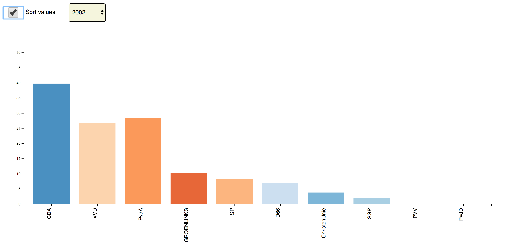

# Assessment 2



## skills needed
* Clean data
* Transition
* Interaction

## background

I got the data from statline.cbs.nl. Its a election result of the latest five elections. 

First i had to clean the data. I took the steps that i had learned at the clean practice. I started with the header and then changed everything that needed to be changed to get a clean index.txt.

I have also cleaned the file so that its better looking on the graph. A long name like: Partij van de Vrijheid, changed to PVV

clean code:
```JS
var header = doc.indexOf("Verkiezingen; Historische uitslagen Tweede Kamer"); //header of the txt

    doc = doc.replace(/Groep Wilders \/ Partij voor de Vrijheid+/g,'PVV');  //changing the long name to pvv for visual aspect
    doc = doc.replace(/"Zetelverdeling per partij+";/g,''); //remove title
    doc = doc.replace(/"aantal"+;/g,'');//remove aantal title
    doc = doc.replace(/-+/g,'')//remove '-' where zetels = 0
    doc = doc.replace(/;/g,',')//replace ; for ,
    doc = doc.replace(/ +/g, '')// delete spaces
    var header2 = doc.indexOf("Onderwerpen_1"); //select subtitle
    var end = doc.indexOf('\n', header2);//end subtitle

    doc = doc.slice(end).trim(); //removing header and subtitle
    
  ```
  
  The bar chart i choose already had a interaction function with a select menu. I got it to work with my dataset. 
  
  The next thing i did was created a sort function based on the example of @wooorm slides. It was difficult combine the two interactions.
  the problems i faced where mainly dueded to the position of code. When i started to combine the change functions it finally worked.
  
  ```JS
    function change() {
    d3.select('select')
      .property('selectedIndex', fields.length - 1)
      .dispatch('change');


    d3.select('input')
      .property('checked', true)
      .dispatch('change');
  }
  
 ```
 
 I also created a color function. It changed the color of the bar, depening on the first x position. I used a color scheme.
 ```JS
 var color = d3.scaleOrdinal(d3.schemeCategory20c);
 
   var bars = group
    .selectAll('.bar')
    .data(data)
    .enter()
    .append('rect')
    .attr('class', 'bar')
    .style('fill', colorBar); //give color by function colorBar
    
  function colorBar(d){ //fuction that defines color for the bar based on a partij

    return color(x(state(d)));

  }
```
 
 ## Data
 
 `Partij` - Party of the dutch political system
 `1994` - 1994 election
 `1998` - 1998 election
 `2002` - 2002 election
 `2003` - 2003 election
 `2005` - 2004 election
 
 ## License
 
 GNU @ Basrikkers
 
 
